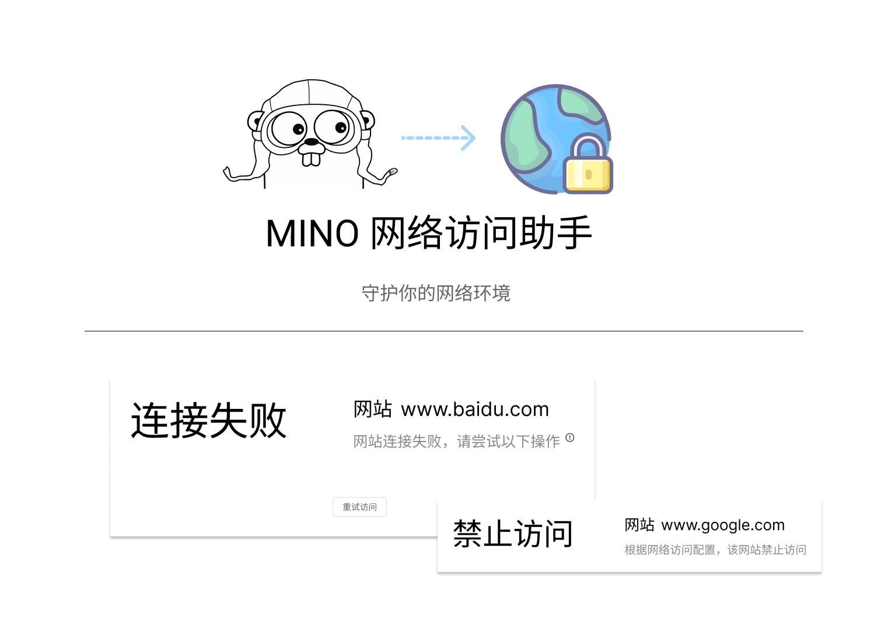

[](https://github.com/dxkite/mino/actions/workflows/docker-image.yml)
[](https://github.com/dxkite/mino/actions/workflows/release.yml)

基于 golang 编写的网络访问助手，使用代理协议实现支持远程访问局域网以及限制指定网站访问，守护家庭成员健康上网

## 特性

- 支持多系统运行
- 支持 `socks5/http` 协议接入
- 支持 `windows` 平台友好界面以及自动设置访问控制
- 支持在局域网中部署服务，允许外部网络访问局域网资源

## 实现

- 使用 `http/socks5` 协议控制网络访问
- **TODO** 实现基于DNS的网络访问控制

## 安装

在版本列表中下载即可使用

## 容器支持

Docker 一键启动服务端

```bash
docker run --restart=always -d -p 28648:28648 dxkite/mino:latest
```

### 命令行

`-addr :1080` 监听 `1080` 端口 支持 http/socks5 协议
`-upstream mino://127.0.0.1:8080`
`-pac_file conf/pac.txt` 启用PAC文件，自动设置系统Pac(windows)
```
mino -addr :1080 -pac_file conf/pac.txt -upstream mino://127.0.0.1:8080
```

`-addr :8080` 监听 `8080` 端口，支持 http/socks5/mino协议（需要配置加密密钥）
直连网络
使用公钥 `-cert_file conf/server.crt` 私钥 `-key_file conf/server.key` 加密连接
```
mino -addr :8080 -cert_file conf/server.crt  -key_file conf/server.key
```

### 使用配置

直接运行会加载  `mino.yml` 作为配置文件

```
mino
```

- 默认配置名 `mino.yml`

指定配置文件：
```
mino -conf config.yml
```

### 配置文件示例

**客户端**

```yaml
address: ":1080"
upstream: "mino://127.0.0.1:28648"
```

**服务端**
```yaml
address: ":28648"
```

